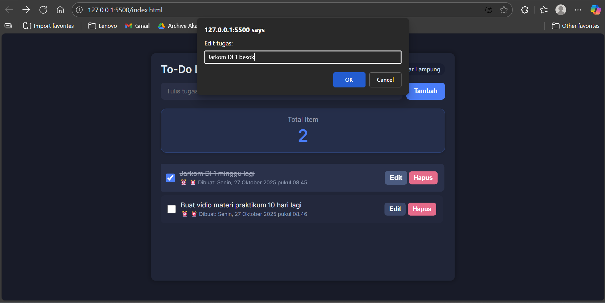

# 🗒️ Personal Dashboard – JavaScript ES6+

Aplikasi ini merupakan **tugas praktikum JavaScript Next Gen (ES6+)**  
yang berfungsi sebagai **personal dashboard berbasis web** untuk mencatat daftar tugas (to-do list).

Dibangun menggunakan **fitur-fitur modern JavaScript (ES6+)**,  
serta dilengkapi dengan penyimpanan lokal menggunakan `localStorage` agar data tetap tersimpan  
meskipun halaman direfresh atau browser ditutup.

---

##  **Fungsi & Fitur Aplikasi**

###  Fungsi Utama:
1. **Menambah tugas baru** dengan tombol atau tekan Enter.  
2. **Mengedit tugas** langsung lewat prompt edit.  
3. **Menghapus tugas** dengan tombol "Hapus".  
4. **Menandai tugas selesai** menggunakan checkbox (otomatis memberi efek coret).  
5. **Menyimpan data secara otomatis** ke `localStorage`.  
6. **Menampilkan waktu & tanggal real-time** sesuai zona waktu *Bandar Lampung (Asia/Jakarta)*.  
7. **Menampilkan tanggal pembuatan tiap tugas.**  
8. **Menampilkan jumlah total tugas (Total Item)** di bagian atas halaman.  
9. **Tampilan responsif** — dapat dibuka dengan rapi di laptop maupun HP.

---

## **Fitur-Fitur ES6+ yang Diimplementasikan**

| Fitur ES6+ | Implementasi |
|-------------|--------------|
| `let` & `const` | Semua variabel dan konstanta menggunakan scope modern ES6 |
| **Arrow Function** | Digunakan pada event listener dan fungsi sederhana seperti `updateStats`, `addTask`, `refreshTime` |
| **Template Literals** | Untuk membangun HTML dinamis pada daftar tugas dan tampilan waktu |
| **Class** | `class Task` digunakan untuk membuat struktur data setiap tugas baru |
| **Destructuring / Spread** | Digunakan implicit dalam mapping data tugas (saat update/edit) |
| **Async/Await (atau Promise)** | Diterapkan dalam pembaruan waktu real-time (fungsi `refreshTime`) |
| **Modules (import/export)** | Struktur kode dibagi ke beberapa file (`main.js`, `storage.js`, `time.js`) dengan sistem `import` dan `export` |
| **LocalStorage API** | Untuk menyimpan data pengguna secara lokal tanpa server |

---
##  **Cara Menjalankan Aplikasi**

> **PENTING:**  
> Aplikasi ini **tidak akan berjalan** jika dibuka langsung dengan metode `file:///` (misalnya: klik dua kali file `index.html`).  
> Karena menggunakan sistem **JavaScript Module (import/export)** yang hanya bisa dijalankan melalui **web server lokal**.

### **Menggunakan Live Server (Disarankan)**
1. Buka folder project di **Visual Studio Code**.  
2. Klik kanan file `index.html` → pilih **“Open with Live Server”**

---

## Screenshot Aplikasi**

## Screenshot Aplikasi

### Tampilan Awal

### Menambah Tugas dan Menampilkannya

### Mengedit Tugas

### Tugas Selesai

### Ketika Tidak Ada Tugas

