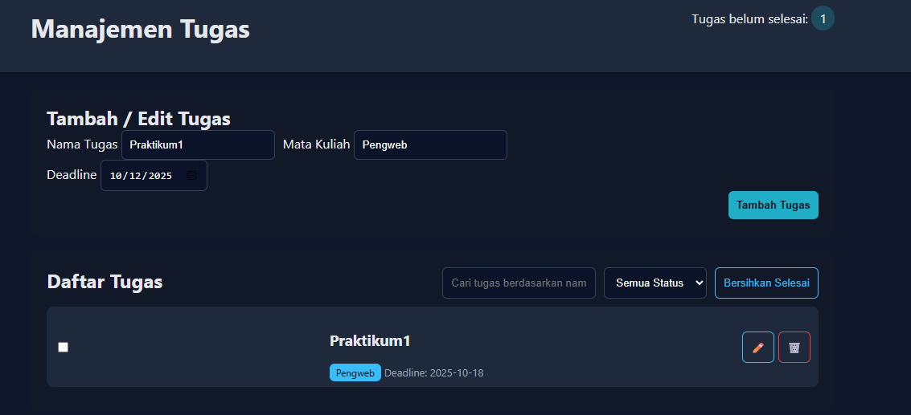
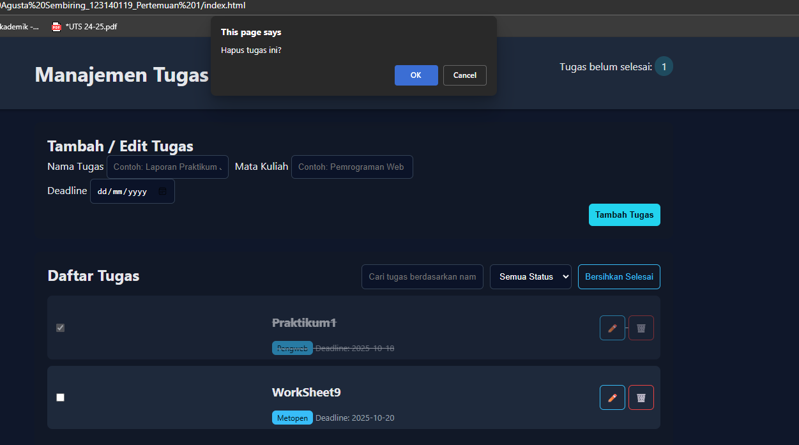

Aplikasi Manajemen Tugas Mahasiswa

Aplikasi web sederhana untuk membantu mahasiswa mengelola tugas kuliah mereka.  
Aplikasi ini memungkinkan pengguna untuk menambahkan, mengedit, menghapus, mencari, menandai, dan membersihkan tugas dengan penyimpanan data menggunakan localStorage (tanpa database).
Fitur Utama
Fitur	Deskirpsi
Tambah Tugas	Menambahkan tugas baru dengan nama tugas, mata kuliah, dan deadline
Edit Tugas	Mengubah data tugas yang sudah ada
Hapus Tugas	Menghapus tugas tertentu dari daftar
Tandai Selesai	Menandai tugas sebagai selesai menggunakan checkbox
Cari Tugas	Mencari tugas berdasarkan nama tugas secara real-time
Filter Status	enampilkan hanya tugas “Selesai”, “Belum Selesai”, atau semua. 
Penyimpanan Otomatis	Semua data tersimpan otomatis di browser menggunakan localStorage. 

Model menambah catatan tugas

Tampilan tugas yang sudah selesai/blm selesai

 

Tampilan menhapus tugas

 
    
Cara Menjalankan Aplikasi
Aplikasi ini adalah frontend murni dan sangat mudah dijalankan:
1.	Unduh file beriikut:
•	index.html
•	style.css
•	script.js	
2.	Buka di Browser: Klik dua kali pada file index.html atau buka menggunakan fitur “Open with Live Server” (jika menggunakan VS Code).
3.	Siap Digunakan: Aplikasi akan langsung terbuka, dan data tugas Anda akan mulai disimpan secara otomatis di browser Anda.
Penjelasan Tekniks
1.	Penggunaan localStorage
Aplikasi ini menggunakan localStorage API dari JavaScript untuk menyimpan array objek tugas secara lokal di browser pengguna.
Tujuan	Metode yang Digunakan
Menyimpan	localStorage.setItem('tasks', JSON.stringify(tasks))
Mengambil	JSON.parse(localStorage.getItem('tasks'))

2.	Implementasi Validasi Form
Validasi diterapkan untuk memastikan kualitas data:
•	Validasi HTML5: Menggunakan atribut required pada elemen <input>.
•	Validasi JavaScript: Dalam fungsi submit, kode memeriksa apakah name, course, atau deadline kosong. Jika ya, pesan error ditampilkan, dan proses penambahan data dicegah (e.preventDefault()).
