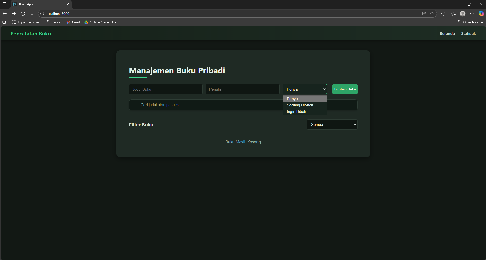
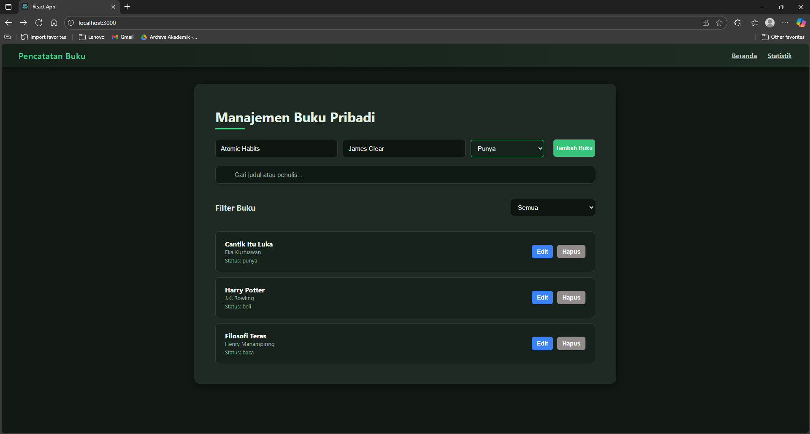
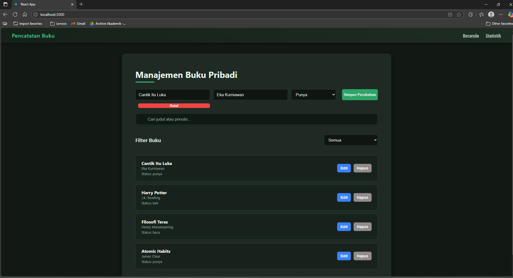
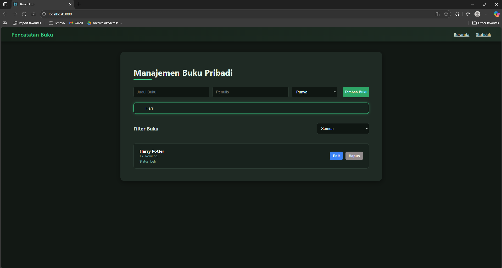
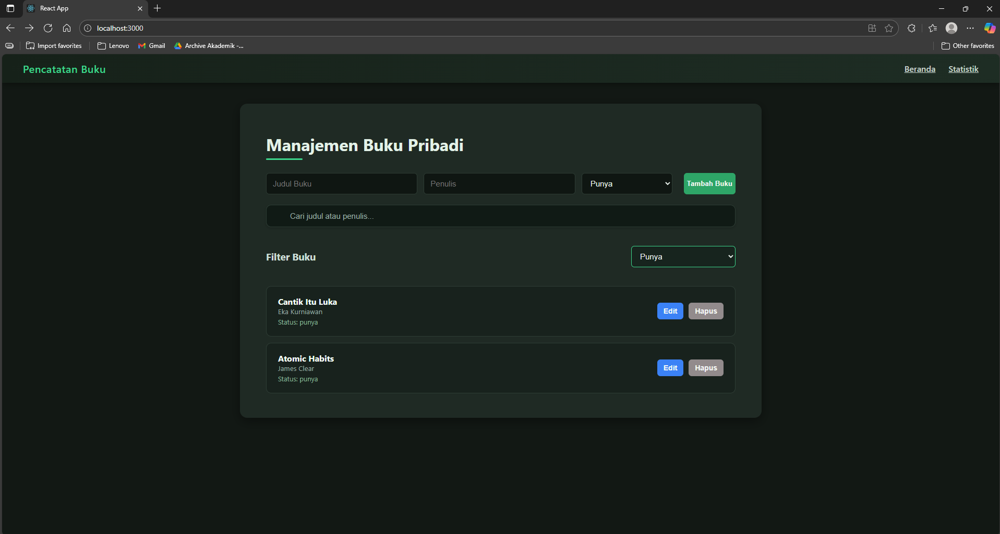

## Deskripsi Aplikasi  

Aplikasi **Manajemen Buku Pribadi** ini dibangun menggunakan **React.js** dengan pendekatan *Component-Based Architecture*.  
Tujuan dari aplikasi ini adalah untuk membantu pengguna dalam mengelola koleksi buku pribadi — baik buku yang sudah dimiliki, sedang dibaca, maupun yang ingin dibeli.  

Pengguna dapat:  
- Menambahkan buku baru (judul, penulis, dan status)  
- Mengedit dan menghapus buku yang ada  
- Memfilter buku berdasarkan status  
- Mencari buku berdasarkan judul atau nama penulis  
- Menyimpan semua data secara otomatis di **localStorage**, agar tetap tersimpan walau halaman direfresh  

---

## ⚛️ Fitur Utama React yang Digunakan

Aplikasi ini dibangun menggunakan berbagai fitur dan hook inti dari React, dikombinasikan dengan pustaka pelengkap, untuk menciptakan pengalaman pengguna yang dinamis, efisien, dan terstruktur.

| No. | Fitur React | Penjelasan & Implementasi |
| :---: | :--- | :--- |
| **1.** | **`useState` Hook** | Digunakan untuk mengelola **state lokal** komponen, seperti penyimpanan data buku (`books`), input formulir (`title`, `author`), dan status pilihan. <br><br> _Contoh:_ `const [books, setBooks] = useState([]);` |
| **2.** | **`useEffect` Hook** | Menerapkan **efek samping** (side effect) di komponen fungsional. Dalam proyek ini, utamanya digunakan untuk: <ul><li>Sinkronisasi data `books` ke **Local Storage** setiap kali state `books` berubah.</li><li>Mengambil data awal dari Local Storage saat komponen pertama kali dimuat.</li></ul> |
| **3.** | **Arsitektur Komponen** | Aplikasi dipecah menjadi **komponen modular** yang berfokus pada tanggung jawab tunggal, membuat kode lebih terkelola dan _reusable_. <ul><li>`BookList.jsx` → Menampilkan daftar buku.</li><li>`BookForm.jsx` → Mengelola proses tambah/edit buku.</li><li>`StatsCard.jsx` → Menampilkan statistik koleksi.</li></ul> |
| **4.** | **Props** | Mekanisme utama untuk **komunikasi data dari komponen induk (parent) ke komponen anak (child)**. Digunakan untuk mengirim data (misalnya `books`) dan fungsi (_callback_) seperti `onDelete` dan `onEdit`. <br><br> _Contoh:_ `<BookList books={books} onDelete={handleDelete} />` |
| **5.** | **Conditional Rendering** | Teknik untuk **menampilkan elemen UI berdasarkan kondisi state atau props** saat ini. Contohnya, menampilkan komponen `BookList` jika ada data, atau menampilkan pesan "Buku Masih Kosong" jika array buku kosong. |
| **6.** | **Event Handling** | Pemanfaatan _event handler_ bawaan React seperti `onClick`, `onChange`, dan `onSubmit` untuk **menangani interaksi pengguna** dan memicu pembaruan state atau fungsi. <br><br> _Contoh:_ `<button onClick={handleAddBook}>` |

---

### Integrasi dan Pustaka Pendukung

#### **1. Navigasi dengan React Router DOM**
Digunakan untuk mengimplementasikan **Single Page Application (SPA)** dengan **navigasi antar halaman** (misalnya Beranda `/` dan Statistik `/stats`) tanpa memerlukan _page reload_ penuh, memberikan pengalaman yang cepat dan dinamis.

#### **2. Local Storage Integration**
Data koleksi buku **disimpan secara lokal** di sisi pengguna menggunakan `localStorage` browser. Ini memastikan data **tetap tersimpan** meskipun pengguna me-_refresh_ atau menutup aplikasi.

#### **3. Styling dengan Tailwind CSS**
Digunakan sebagai _utility-first CSS framework_ untuk membangun antarmuka pengguna yang **modern dan responsif**. Styling diterapkan langsung melalui `className` pada elemen React, mengoptimalkan proses pengembangan UI.

---
 
## Tampilan Aplikasi

### 🔹 Tampilan Utama  
Menampilkan halaman utama dengan daftar buku dan navigasi menu.  



### 🔹 Menambahkan Buku  
Form untuk menambahkan buku baru beserta penulis dan statusnya.  



### 🔹 Edit Buku  
Mengubah data buku yang sudah ada, seperti judul, penulis, dan status.  



### 🔹 Fitur Pencarian  
Mencari buku berdasarkan judul atau nama penulis.  



### 🔹 Statistik Koleksi Buku  
Menampilkan total buku dan pembagian status koleksi.  


### 🔹 Filter Buku  
Menyaring daftar buku berdasarkan status tertentu (*Punya*, *Sedang Dibaca*, *Ingin Dibeli*).  


---

## Instruksi Instalasi dan Menjalankan

```bash
# Clone Repositori
git clone https://github.com/username/pemrograman_web_itera_123140119.git

# Masuk ke Folder Project
cd prima_agusta_sembiring_123140119_pertemuan3

# Install Dependensi
npm install

# Menjalankan Aplikasi
npm start

# (Opsional) Menjalankan Testing
npm test

