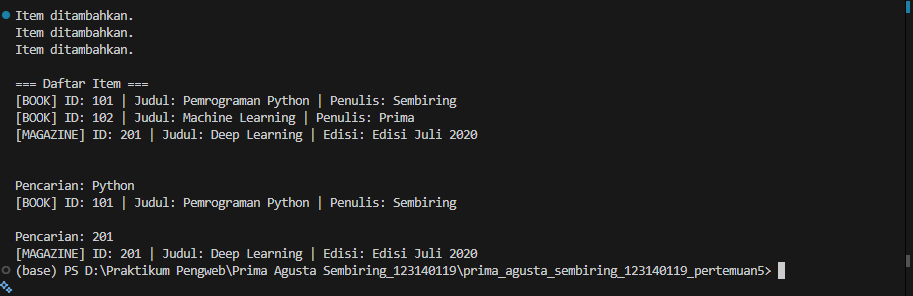

# 📘 Sistem Manajemen Perpustakaan (Python OOP)

## 1. Deskripsi Program
Program ini merupakan sistem manajemen perpustakaan sederhana menggunakan konsep **Object-Oriented Programming (OOP)** pada Python.  
Program dapat digunakan untuk:
- Menambahkan item ke perpustakaan  
- Menampilkan seluruh daftar item  
- Mencari item berdasarkan **judul** atau **ID**  

Program ini mengimplementasikan konsep OOP seperti abstract class, inheritance, encapsulation, polymorphism, dan property decorator.

---

## 2. Fitur Program
### Menambahkan Item  
Menambah buku atau majalah ke dalam perpustakaan.

### Menampilkan Semua Item  
Menampilkan seluruh koleksi item dengan bentuk tampilan berbeda untuk setiap jenis item.

### Mencari Item  
Pencarian berdasarkan:
- Judul
- ID item

### Penerapan OOP
- Abstract Class → `LibraryItem`  
- Inheritance → `Book` & `Magazine`  
- Encapsulation → atribut private & protected  
- Polymorphism → `display_info()`  
- Property Decorator → `title`

---

## 3. Struktur Class

### **LibraryItem (Abstract Class)**
- `_item_id`  
- `_title`  
- `display_info()` *(abstract)*  

### **Book**
- Mewarisi `LibraryItem`  
- Atribut: `__author`  
- Override `display_info()`  

### **Magazine**
- Mewarisi `LibraryItem`  
- Atribut: `_issue`  
- Override `display_info()`  

### **Library**
- Atribut private: `__items`  
- Method:  
  - `add_item()`  
  - `show_all_items()`  
  - `search_item()`  

---

## 4. Cara Menjalankan Program
Jalankan melalui terminal:

```
python library.py
```

---

## 5. Screenshot Hasil Running Program  
*(Tambahkan screenshot di bagian ini setelah upload ke GitHub)*

Contoh output:

Screenshot Input Program


Screenshot Output Program


---

## 6. Diagram Class (Opsional)

```
             ┌──────────────────────┐
             │    LibraryItem (ABC) │
             ├──────────────────────┤
             │ - _item_id           │
             │ - _title             │
             ├──────────────────────┤
             │ + display_info() *   │
             └─────────▲────────────┘
                       │
        ┌──────────────┼──────────────┐
        │                             │
┌───────────────┐              ┌──────────────┐
│     Book      │              │   Magazine   │
├───────────────┤              ├──────────────┤
│ - __author    │              │ - _issue     │
├───────────────┤              ├──────────────┤
│ + display_info│              │ + display_info│
└───────────────┘              └──────────────┘

                ┌─────────────────────┐
                │       Library       │
                ├─────────────────────┤
                │ - __items           │
                ├─────────────────────┤
                │ + add_item()        │
                │ + show_all_items()  │
                │ + search_item()     │
                └─────────────────────┘

